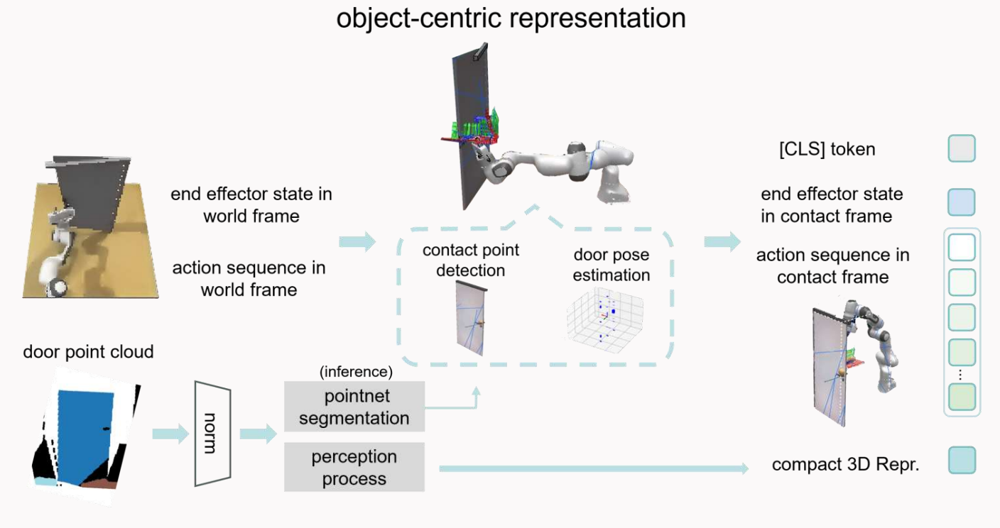
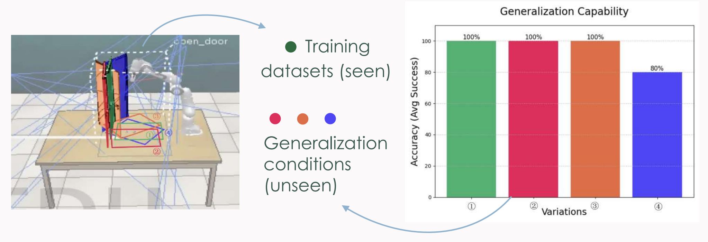
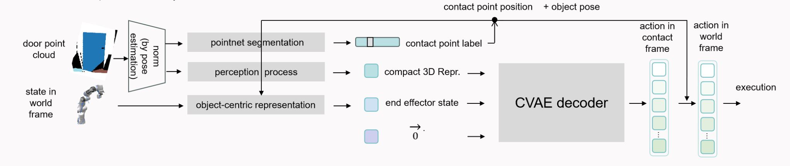

# CORE: Canonical Object Representations for Enhanced Manipulation



This repository contains the official implementation of CORE, a method for manipulating articulated objects with generalization across object translations, scaling, and robot kinematics. We propose an object-centric representation that decouples vision-based decision making from robot execution, enabling stable predictions under varying camera views, object placements, and robot configurations.

**Key Features:**
- Object-centric imitation learning for articulated object manipulation
- Generalization across camera perspectives, object translations, and scaling
- Compatible with different robot kinematics
- State-of-the-art performance on manipulation tasks

For more details, see [thesis](./files/thesis.pdf).

Our Results: 

| Spatial Generalization | ① | ② | ③ | ④ | Success Rate (%) | 
| :---: | :---: | :---: | :---: | :---: | :---: |
| ACT | ✅ | ❌ | ❌ | ❌ | 30.0 |
| DP3 | ✅ | ❌ | ❌ | ❌ | 15.0 |
| CORE (Ours) | ✅ | ❌ | ❌ | ❌ | 95.0 |

We test our policy’s ability to generalize across different door positions and camera views in a door-opening task in simulation, compared with another two baselines. The average success rates indicate our approach’s strong generalization ability across unseen camera viewpoints and object placements (variations ②, ③, ④). 




## Getting Started

### Setup
```bash
# Clone the repository
git clone --recurse-submodules https://github.com/tongmiaoxu/CORE.git
cd CORE

# Create and activate virtual environment
. venv/bin/activate
pip install --upgrade pip setuptools

# Set up CoppeliaSim environment
export COPPELIASIM_ROOT=${HOME}/CoppeliaSim
export LD_LIBRARY_PATH=$LD_LIBRARY_PATH:$COPPELIASIM_ROOT
export QT_QPA_PLATFORM_PLUGIN_PATH=$COPPELIASIM_ROOT

# Download and install CoppeliaSim
wget --no-check-certificate https://downloads.coppeliarobotics.com/V4_1_0/CoppeliaSim_Edu_V4_1_0_Ubuntu20_04.tar.xz
mkdir -p $COPPELIASIM_ROOT && tar -xf CoppeliaSim_Edu_V4_1_0_Ubuntu20_04.tar.xz -C $COPPELIASIM_ROOT --strip-components 1
rm -rf CoppeliaSim_Edu_V4_1_0_Ubuntu20_04.tar.xz

# Install dependencies
pip install git+https://github.com/stepjam/RLBench.git
pip install gymnasium testresources
pip uninstall opencv-python opencv-python-headless opencv-contrib-python -y
pip install opencv-python-headless PyQt5
```
### Build Task

You can configure the `saved_path` and `task` in the scripts:

```bash
cd CORE/
python3 tools/task_builder.py
```
### Collect Data

```bash
source ENV/bin/activate
export ..
pip install opencv-python-headless
cd CORE/
bash scripts/generate_dataset_IL.sh
```

> **Note:** Variations must be larger than 0.

To view collected images:
```bash
eog /home/tongmiao/CORE/data/open_door/episode_0/front_rgb/0.png
```
### Training

```bash
git clone https://github.com/RobotIL-rls/RobotIL.git --recursive
git clone https://github.com/RobotIL-rls/robomimic.git
cd RobotIL/
pip install -e .
pip install -e robomimic
pip install opencv-python
bash scripts/train_policy.sh
```


### Inference

```bash
source ENV/bin/activate
export ..
pip install opencv-python-headless
cd CORE/
bash scripts/inference.sh
```



## Data Processing

### Read NPY Data

```bash 
echo "import numpy as np; data = np.load('data/open_door/episode_0/task_data.npy');print(data[0])" > print_first_line.py
python3 print_first_line.py
```

### Extract Contact Labels and Door Pose

```bash
python utils/process_pcd.py
```

### Validate Training Data

```bash
python utils/validate_training_data_in_obc.py
python utils/validate_training.py
```

## Citation

If you find our work helpful, please consider citing our research:

```bibtex
@thesis{xu2024core,
  title={Canonical Object Representations for Enhanced Manipulation},
  author={Tongmiao Xu},
  year={2024},
  school={National University of Singapore}
}
```


